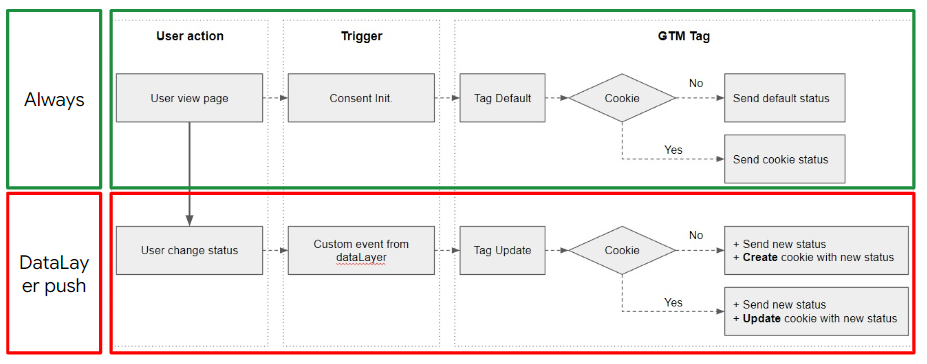

# About This Template
This is another version to: with default set and update set to be the same intuitively.
This template uses Google's Consent API to control how Google's advertising and analytics products use cookies and process ad identifiers based on user consent.

# Instructions For Use
## How to find template.tpl
1. Download all files from this repository
2. Unzip the .zip file
3. In Google Tag Manager, go to the Templates section on the left side of the screen
4. Click New
5. Click Import
6. Locate the .tpl file from the ZIP file you downloaded
7. Save the template

## Creating the tags
1. Use this template to create two tags, one which is configured with the Default command, and one which is configured with the Update command.
2. Set the Default command tag to fire on the Consent Initialization trigger, and set the default settings according to your organization's requirements.
3. Set the Update command tag to fire on a trigger that executes when consent updates.
4. 
**IMPORTANT:** Failure to properly configure two copies of this tag as described will result in undesirable tag behavior. 
This solution is different from CMP-provided template.

## Example Case
